# BrightKids

> A kid-friendly web app that teaches **Hebrew**, **English**, and **Math** to children in **grades 1–6** — shipped as a single Go binary serving an embedded, offline-capable PWA.

BrightKids is audio-first, mobile-first, and zero-PII: profiles are just a name and a buddy a child picks, stored locally. No accounts, no tracking, no external calls from the child's device. A friendly droid guide named **Bibo** narrates prompts and cheers every correct answer.

<p align="center">
  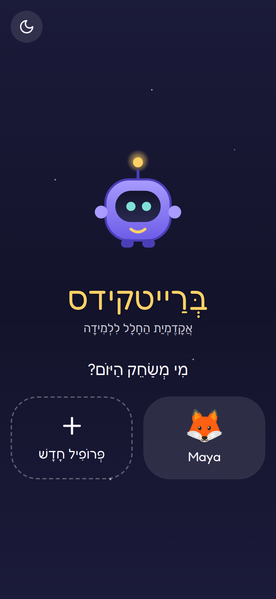
</p>

---

## Features

- **Trilingual content** — Hebrew (RTL, grades 1–5), English (LTR, grades 1–4), and Math (grades 1–6), with proper BiDi isolation for mixed Hebrew/digit text.
- **Seven activity types** — letter recognition, multiple choice, counting, arithmetic, matching, drag-to-order, and finger **tracing** (canvas with mask-coverage scoring).
- **Curriculum-based exercises** — built from a real graded worksheet curriculum. Math (g1–6) spans counting, comparison ("Who is bigger?"), number sense, place value, the four operations, sequences, even/odd, fractions, decimals, order of operations, rounding, word problems, and clock reading. Hebrew (g1–5) covers vowels, reading comprehension, synonyms/opposites, verbs, and sentence ordering; English (g1–4) covers ABC, phonics, word families, and graded reading. Math & Hebrew narrate in Hebrew; English in English.
- **Audio-first** — tap-to-hear on every prompt plus auto-narration on load via the Web Speech API (he-IL / en-US), so pre-readers can play.
- **Playful rewards** — confetti, synthesized sound effects, Bibo reactions, stars, and a daily streak. Mistakes get a gentle "try again," never a shaming buzzer.
- **Accessible** — 48px tap targets, `prefers-reduced-motion` honored, OpenDyslexic toggle, dark mode, high-contrast palette.
- **Installable PWA** — works offline; lessons and assets (including Hebrew fonts) are precached.
- **Single binary** — Go serves the embedded SPA, a small JSON API, Prometheus metrics, and health probes. Pure-Go SQLite (no CGO) for local profiles and progress.
- **Zero PII** — no accounts, no analytics, no per-child identifiers in metrics.

## Screenshots

| Choose a subject | A lesson | Tracing |
|---|---|---|
|  | 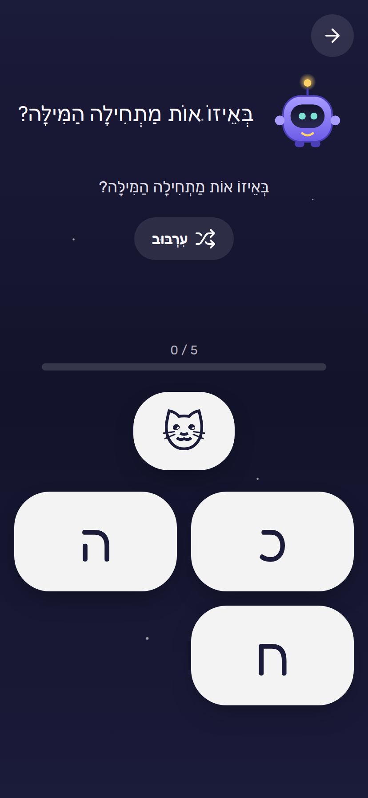 | 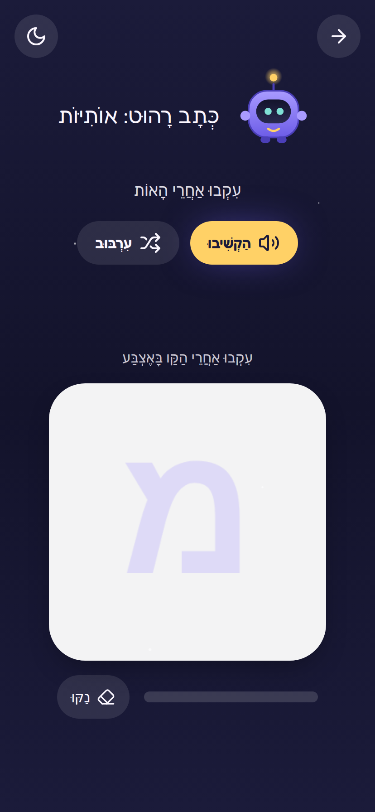 |

| Math concepts | Math practice set | Who is bigger? | Rewards |
|---|---|---|---|
| 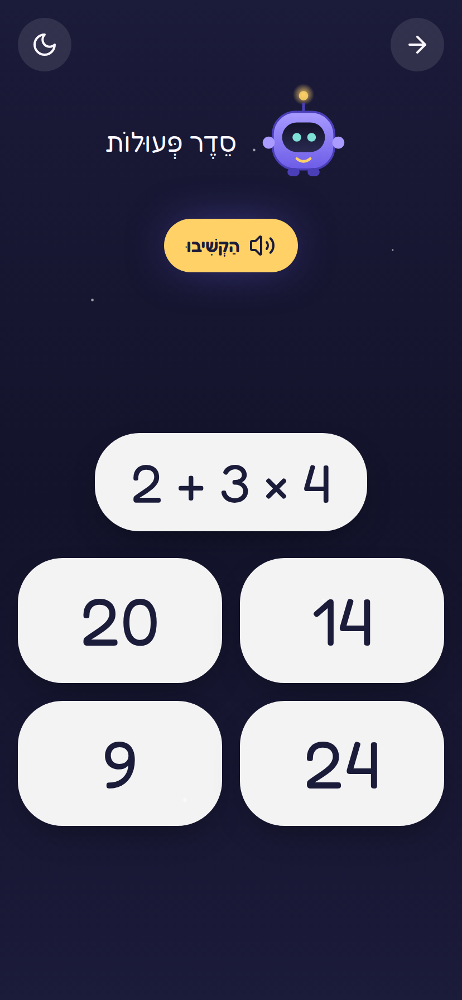 | 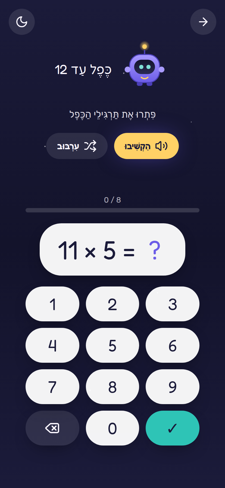 | 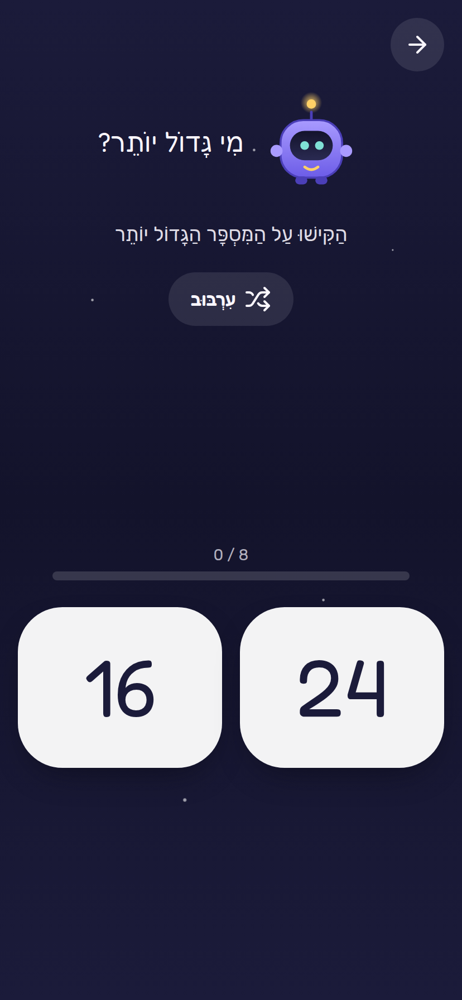 | 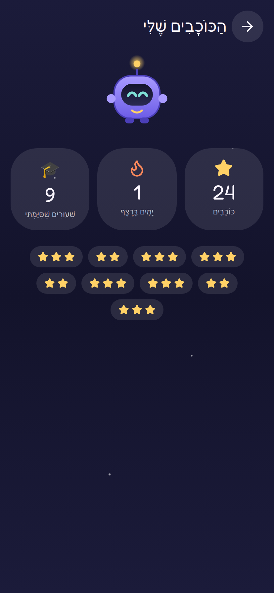 |

| Settings (parent-gated) | Lesson list | Dark mode | OpenDyslexic |
|---|---|---|---|
| 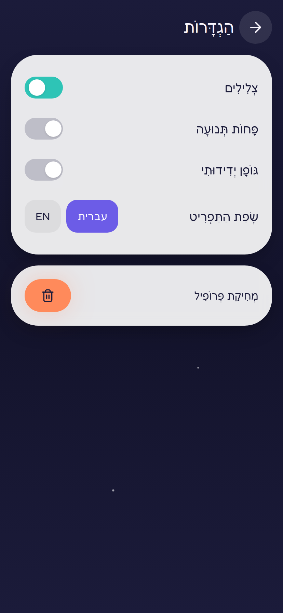 | 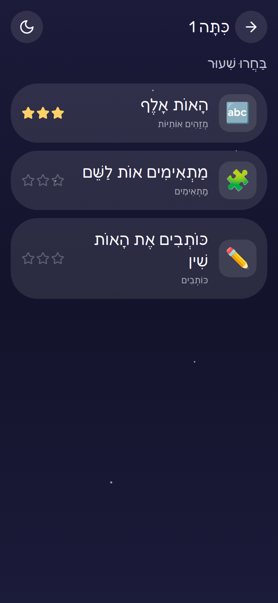 | 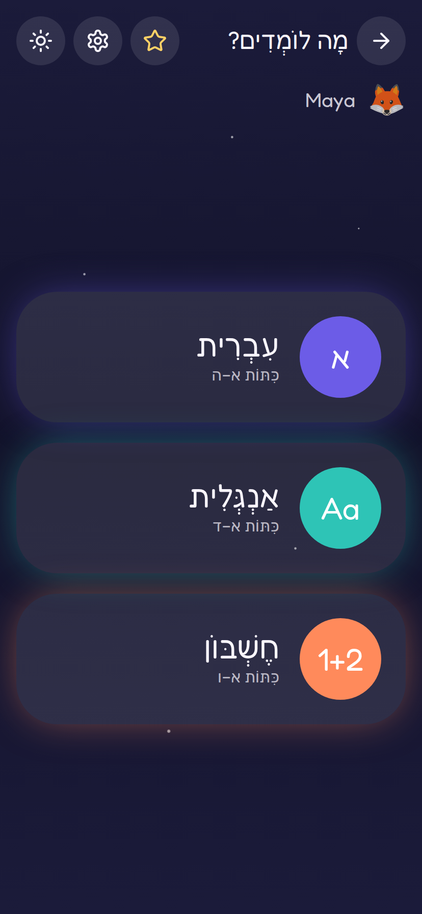 | 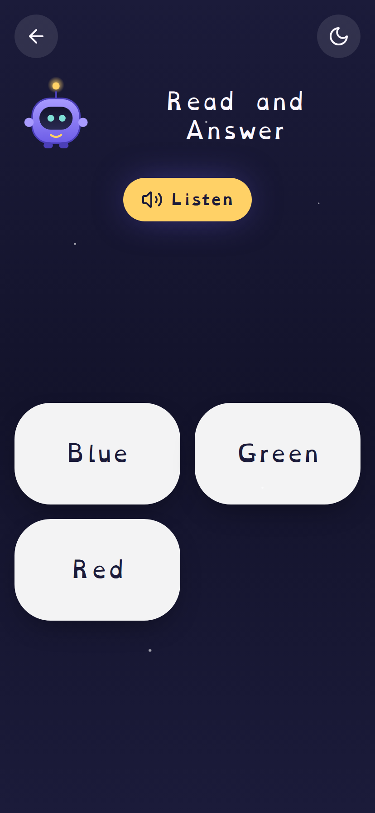 |

## Quick start

### Docker

```bash
docker run -p 8080:8080 techblog/brightkids:latest
# open http://localhost:8080
```

### docker-compose (with persistent profiles)

```bash
docker compose -f deployments/docker-compose.yml up -d
```

The named `brightkids-data` volume holds the SQLite database so profiles and
progress survive restarts. The image runs as a non-root user; use the named
volume (not a host bind mount) so `/data` ownership is correct.

### From source

```bash
make build      # builds the SPA, embeds it, and builds ./brightkids
./brightkids --log-format text --log-level debug
```

### Local development (hot reload)

```bash
# terminal 1 — backend
go run ./cmd/brightkids --log-format text --log-level debug

# terminal 2 — frontend (proxies /api to :8080)
cd web && npm install && npm run dev
```

## Configuration

Precedence: **flags > env > YAML > defaults**. Copy `config.yaml.example` to
`config.yaml` to use a file. Env vars are prefixed `BRIGHTKIDS_`.

| Key | Flag | Env | Default | Notes |
|---|---|---|---|---|
| `server.host` | `--host` | `BRIGHTKIDS_SERVER_HOST` | `0.0.0.0` | |
| `server.port` | `--port` | `BRIGHTKIDS_SERVER_PORT` | `8080` | |
| `db.path` | `--db-path` | `BRIGHTKIDS_DB_PATH` | `./brightkids.db` | `:memory:` allowed |
| `log.level` | `--log-level` | `BRIGHTKIDS_LOG_LEVEL` | `info` | `debug`/`info`/`warn`/`error` |
| `log.format` | `--log-format` | `BRIGHTKIDS_LOG_FORMAT` | `json` | `text` for dev |
| `content.dir` | `--content-dir` | `BRIGHTKIDS_CONTENT_DIR` | *(embedded)* | hot-iterate lesson YAML |
| `metrics.enabled` | `--metrics` | `BRIGHTKIDS_METRICS_ENABLED` | `true` | |

`--version` prints build info and exits.

## HTTP API

All endpoints are under `/api/v1` and return JSON. Content is read-only;
profiles and progress are local to the device/server.

| Method | Path | Purpose |
|---|---|---|
| `GET` | `/api/v1/subjects` | subjects and their grades |
| `GET` | `/api/v1/lessons?subject=&grade=` | lesson summaries |
| `GET` | `/api/v1/lessons/{id}` | full lesson (items, tts, reward) |
| `GET` | `/api/v1/profiles` | list local profiles |
| `POST` | `/api/v1/profiles` | create a profile `{name, avatar, locale_pref}` |
| `DELETE` | `/api/v1/profiles/{id}` | delete a profile |
| `GET` | `/api/v1/profiles/{id}/progress` | progress, total stars, streak |
| `POST` | `/api/v1/profiles/{id}/progress` | record an attempt `{lesson_id, stars}` |
| `GET` | `/api/v1/profiles/{id}/settings` | profile settings |
| `PUT` | `/api/v1/profiles/{id}/settings` | update settings |
| `GET` | `/healthz` · `/readyz` | liveness · readiness |
| `GET` | `/metrics` | Prometheus metrics |

## Architecture

```
[ Browser / PWA ]  --static-->  embedded SPA (React + Vite + TS)
   Web Speech (TTS) · Web Audio (SFX) · confetti — all client-side
        |  fetch JSON
        v
[ Go binary: chi ]  /api/v1  ·  /metrics  ·  /healthz /readyz  ·  SPA fallback
        |
        v
[ modernc.org/sqlite ]  local profiles, progress, settings
```

Lessons live as schema-validated YAML under `content/`, embedded into the binary
and loaded into memory at boot (the server fails fast on malformed content). The
built SPA is embedded via `go:embed`. CGO is disabled everywhere for clean
static multi-arch builds.

## Metrics

Prometheus, namespace `brightkids`: `http_requests_total{method,route,status}`,
`http_request_duration_seconds{route}`, `lessons_completed_total{subject,grade}`,
`build_info{version,commit}`, plus standard Go/process collectors. No per-child
identifiers — aggregate only.

## Building & releasing

```bash
make web        # build the SPA into the Go embed dir
make build      # web + go build -> ./brightkids
make test       # go test -race + frontend tests
make lint       # golangci-lint + eslint
make scan       # security scans -> scans/ (gitignored)
make docker     # local multi-arch buildx
make release    # goreleaser --snapshot --clean
```

Releases are date-versioned `vYYYY.M.PATCH` (no leading zero on the month).
GitHub Actions handle CI (`ci.yml`), GitHub Releases (`release.yml`, GoReleaser),
and multi-arch Docker publishing to `techblog/brightkids` (`docker.yml`).

## License

[Apache-2.0](LICENSE).
