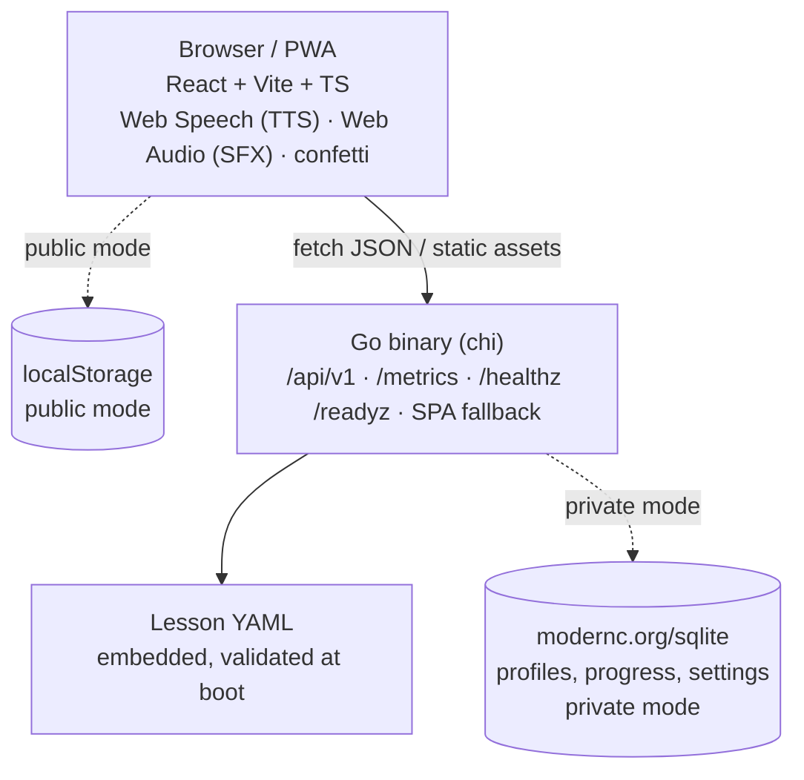

# BrightKids

[](https://hub.docker.com/r/techblog/brightkids)
[](https://hub.docker.com/r/techblog/brightkids)
[](LICENSE)

> A kid-friendly web app that teaches **Hebrew**, **English**, and **Math** to children across **stages 1–6**, shipped as a single Go binary that serves an embedded, offline-capable PWA.

BrightKids is mobile-first and zero-PII. A profile is only a name and a buddy
(an emoji avatar) that the child picks. There are no accounts and no tracking,
and the app loads everything from its own server: it makes no third-party calls
unless you opt in to Google Analytics. A friendly droid guide named **Bibo**
cheers every correct answer, and optional narration reads prompts aloud.

<p align="center">
  
</p>

---

## Contents

- [Features](#features)
- [Screenshots](#screenshots)
- [Requirements](#requirements)
- [Quick start](#quick-start)
- [Configuration](#configuration)
- [Using the app](#using-the-app)
- [Content authoring](#content-authoring)
- [HTTP API](#http-api)
- [Architecture](#architecture)
- [Metrics](#metrics)
- [Privacy & security](#privacy--security)
- [Troubleshooting](#troubleshooting)
- [Development](#development)
- [Building & releasing](#building--releasing)
- [Contributing](#contributing)
- [License](#license)

## Features

- **Trilingual content**: Hebrew (RTL, stages 1–5), English (LTR, stages 1–4), and Math (stages 1–6), with proper BiDi isolation for mixed Hebrew/digit text.
- **Eight activity types**: letter recognition, multiple choice, counting, arithmetic, "who is bigger?" comparison, matching, drag-to-order, and finger **tracing** (canvas with mask-coverage scoring).
- **Curriculum-based exercises**, built from a real graded worksheet curriculum. Math (stages 1–6) spans counting, comparison ("Who is bigger?"), number sense, place value, the four operations, sequences, even/odd, fractions, decimals, order of operations, rounding, word problems, and clock reading. Hebrew (stages 1–5) covers vowels, reading comprehension, synonyms/opposites, verbs, and sentence ordering. English (stages 1–4) covers the ABC, phonics, word families, and graded reading. Math and Hebrew are narrated in Hebrew, English in English; on-screen instructions are always in Hebrew.
- **Randomized practice**: pick a subject, then a stage. Every lesson holds a large pool and samples a fresh set on each play, with a **shuffle** button to redraw for endless variety.
- **Flag game (מִי הַמְּדִינָה?)**: a top-level game beside the subjects. Spot the country behind the flag from 4 Hebrew options. 90 countries (including Israel) with bundled SVG flags (no emoji fallbacks), 10 per round, and shuffle to keep going, competition style.
- **Optional narration**: text-to-speech is **off by default**. Enable it with `BRIGHTKIDS_TTS_ENABLED=true` to get a tap-to-hear **Listen** button (he-IL for Hebrew/Math, en-US for English) and a per-profile "Read aloud" setting. There is no auto-play, so the screen stays calm.
- **Playful rewards**: confetti, synthesized sound effects, Bibo reactions, stars, and a daily streak. Mistakes get a gentle "try again," never a shaming buzzer.
- **Accessible**: 48px tap targets, `prefers-reduced-motion` honored (plus a per-profile "reduce motion" switch), an OpenDyslexic font option, and picture-first activities so pre-readers can play.
- **Hebrew or English UI**: each profile picks the interface language (Hebrew by default).
- **Self-hosted or public**: one binary, two modes via `BRIGHTKIDS_MODE`. **private** stores profiles and progress in pure-Go SQLite; **public** is stateless, with no database, and profiles live in the browser's `localStorage`.
- **SEO-ready**: auto-generated `robots.txt` and `sitemap.xml` and per-page browser titles in every mode; in public mode the server also injects per-page Open Graph / Twitter meta with a branded social image. Optional Google Analytics via `BRIGHTKIDS_ANALYTICS_GA_ID`.
- **Installable PWA**: works offline. The app shell and assets (including fonts and flags) are precached, and the lesson API is cached for offline play.
- **Single binary**: Go serves the embedded SPA, a small JSON API, Prometheus metrics, and health probes. Static builds for Linux, macOS, and Windows, and a multi-arch `scratch` Docker image.
- **Zero PII**: no accounts and no per-child identifiers in metrics. Analytics is opt-in and off by default.

## Screenshots

| Choose a subject | Choose a stage | Lesson list | Stars & streak |
|---|---|---|---|
|  |  |  |  |

| Picture → first letter | Match the pairs | Build a sentence | Trace the letters |
|---|---|---|---|
|  |  |  |  |

| Order of operations | Times tables | Who is bigger? | Word problems |
|---|---|---|---|
|  |  |  |  |

| Settings | OpenDyslexic font | Flag game (מי המדינה?) |
|---|---|---|
|  |  |  |

Social preview (the Open Graph image served in public mode):


## Requirements

- **To run**: Docker, or nothing at all for the static binary (CGO is
  disabled). Any modern browser works as the client; narration
  needs a browser with the Web Speech API and a Hebrew and/or English voice
  installed.
- **To build from source**: Go 1.25+ (see `go.mod`) and Node.js 20+ with npm
  (the SPA is built with Vite and embedded into the binary).

## Quick start

### Docker

Multi-arch images (`linux/amd64`, `linux/arm64`) are published to Docker Hub as
[`techblog/brightkids`](https://hub.docker.com/r/techblog/brightkids), tagged
`latest` and `YYYY.M.PATCH`.

```bash
docker run -p 8080:8080 techblog/brightkids:latest
# open http://localhost:8080
```

The image declares `/data` as a volume, so without `-v` the private-mode SQLite
database goes to an anonymous volume that a new container won't reuse. Mount a
named volume on `/data` so profiles and progress carry over:

```bash
docker run -p 8080:8080 -v brightkids-data:/data techblog/brightkids:latest
```

The image is built `FROM scratch`, runs as the non-root user `65534`, and
defaults to `BRIGHTKIDS_DB_PATH=/data/brightkids.db`.

### Docker Compose

```bash
docker compose up -d
# open http://localhost:8080
```

The bundled [`docker-compose.yml`](docker-compose.yml) runs **private** mode by
default: the named `brightkids-data` volume holds the SQLite database, so
profiles and progress survive restarts. The image runs as a non-root user, so
use the named volume (not a host bind mount) for correct `/data` ownership.

For a **public** deployment, set `BRIGHTKIDS_MODE: public` and drop the volume.
The server is stateless and stores nothing (profiles live in the browser). To
enable analytics, uncomment `BRIGHTKIDS_ANALYTICS_GA_ID` and set your Google
measurement ID. To enable narration, add `BRIGHTKIDS_TTS_ENABLED: "true"`.

### From source

```bash
git clone https://github.com/t0mer/brightkids.git
cd brightkids
make build      # builds the SPA, embeds it, and builds ./brightkids
./brightkids --log-format text --log-level debug
# open http://localhost:8080
```

There are no prebuilt binaries on GitHub Releases yet; the
[release workflow](#building--releasing) will attach them once it runs.

## Configuration

Precedence: **flags > env > YAML > defaults**. Copy
[`config.yaml.example`](config.yaml.example) to `config.yaml` in the working
directory (loaded automatically if present), or point at any file with
`--config <path>`. Env vars are prefixed `BRIGHTKIDS_`, with `.` in the key
replaced by `_`.

| Key | Flag | Env | Default | Notes |
|---|---|---|---|---|
| — | `--config` | — | `./config.yaml` (optional) | Path to a YAML config file. An explicit path must exist. |
| `mode` | `--mode` | `BRIGHTKIDS_MODE` | `private` | `private` (DB-backed) or `public` (browser-only); see below |
| `server.host` | `--host` | `BRIGHTKIDS_SERVER_HOST` | `0.0.0.0` | Listen address |
| `server.port` | `--port` | `BRIGHTKIDS_SERVER_PORT` | `8080` | 1–65535 |
| `db.path` | `--db-path` | `BRIGHTKIDS_DB_PATH` | `./brightkids.db` (`/data/brightkids.db` in Docker) | SQLite file; `:memory:` allowed; ignored in public mode |
| `log.level` | `--log-level` | `BRIGHTKIDS_LOG_LEVEL` | `info` | `debug`/`info`/`warn`/`error` |
| `log.format` | `--log-format` | `BRIGHTKIDS_LOG_FORMAT` | `json` | `json` or `text` (for dev) |
| `content.dir` | `--content-dir` | `BRIGHTKIDS_CONTENT_DIR` | *(embedded)* | Load lesson YAML from a directory instead of the embedded set, to hot-iterate on content |
| `metrics.enabled` | `--metrics` | `BRIGHTKIDS_METRICS_ENABLED` | `true` | Serve `/metrics`; disable with `--metrics=false` |
| `analytics.ga_id` | `--ga-id` | `BRIGHTKIDS_ANALYTICS_GA_ID` | *(off)* | Google Analytics measurement ID (e.g. `G-XXXXXXXXXX`); injects gtag.js into pages when set. Invalid IDs are ignored with a warning. |
| `tts.enabled` | `--tts` | `BRIGHTKIDS_TTS_ENABLED` | `false` | Enable text-to-speech narration (Listen button and voice setting) |

`--version` prints build info (version, commit, date, Go version) as JSON and exits.
`--help` lists all flags.

### Storage mode: private vs public

The same binary runs two ways, chosen by `mode`:

- **`private`** (default, self-hosted): child profiles, progress, and settings
  are persisted **server-side** in pure-Go SQLite (`db.path`). Good for a home
  lab or family device where progress should survive across browsers.
- **`public`**: for a stateless public deployment. Profiles, progress, and
  settings live **only in the browser's `localStorage`** (key
  `brightkids:data`). The server opens **no database** and exposes no profile
  endpoints. Each visitor's data stays on their own device, so the server holds
  zero personal data and scales without a volume. Public mode also injects
  per-page SEO meta into the served HTML.

```bash
# Public web (no database, profiles in the browser):
docker run -p 8080:8080 -e BRIGHTKIDS_MODE=public techblog/brightkids:latest
```

The SPA reads `GET /api/v1/config` at boot to learn the mode (and whether
narration is enabled) and routes profile storage accordingly, so no rebuild is
needed to switch.

## Using the app

1. **Pick or create a profile**: type a name and choose a buddy (🦊 🦉 🐱 🤖 🐢 🦄 🐬 🦁 🐧 🐸).
2. **Choose a subject** (Hebrew, English, Math) or jump into the **flag game**.
3. **Choose a stage**, then a lesson. Each lesson samples a fresh set of
   questions; tap **shuffle** to redraw.
4. **Earn stars**: finishing a lesson records stars and extends the daily
   streak, shown on the rewards screen.
5. **Settings** (per profile): sound effects, read aloud (only when narration is
   enabled on the server), reduce motion, OpenDyslexic font, interface language
   (Hebrew/English), and deleting the profile.

## Content authoring

Lessons are YAML files (`*.yaml` or `*.yml`) under [`content/`](content/) (`hebrew/`, `english/`,
`math/`), embedded into the binary at build time. At boot every lesson file is
decoded with unknown fields rejected and then validated. A malformed file or a
duplicate `id` stops the server with an error naming the file; a library with no
lessons at all stops it with `no lessons found`.

To iterate without rebuilding, point `--content-dir` at a directory with the
same layout. It **replaces** the embedded content rather than merging with it,
and it is read once at startup, so restart the server to pick up edits.

Common fields:

| Field | Required | Notes |
|---|---|---|
| `id` | yes | Unique lesson ID |
| `subject` | yes | `hebrew`, `english`, or `math` |
| `grade` | yes | Stage, 1–6 |
| `difficulty` | yes | 1–3 |
| `locale` | no | Narration locale, e.g. `he-IL`, `en-US` |
| `direction` | yes | `rtl` or `ltr` |
| `title` | yes | Shown in the lesson list |
| `activity` | yes | One of the activity types below |
| `prompt_tts` | yes | Spoken instruction, in the lesson's language |
| `instruction` | no | On-screen instruction (Hebrew); falls back to `prompt_tts` |
| `audio` | no | Optional audio path for the lesson prompt |
| `reward` | yes | `{ stars: >=1, sfx, effect }`, e.g. `{ stars: 3, sfx: ding, effect: confetti }` |
| `sample` | no | Questions per play for a multiple-choice set (the flag game uses 10) |
| `hidden` | no | Keep out of stage lists but loadable by ID (used for the flag game) |

Activity-specific fields:

| `activity` | Content |
|---|---|
| `multiple-choice` | `items` (≥2, exactly one `correct: true`) or a `questions` set, each with its own `items` and optional `prompt`, `prompt_text`, `glyph`, `image` |
| `letter-recognition` | Same as `multiple-choice` |
| `tracing` | `glyph`, or a `glyphs` pool (one is picked per play) |
| `matching` | `pairs` (≥2) of `{id, left, right}` with optional `left_tts`, `right_tts`, `emoji`; `right` may be omitted when `emoji` is set |
| `counting` | `problem: {operator: count, answer: N}` plus a `glyph` (emoji to count) or `items` |
| `arithmetic` | `problem` or a `problems` set of `{operands, operator, answer}` |
| `drag-drop` | `items` plus `solution` (ordered item IDs), or `sentences` (lists of words in order) |
| `comparison` | `comparisons` of `{left, right}`: distinct non-negative numbers; the larger one is correct |

Every item needs an `id` and may carry `label`, `emoji`, `image`, `tts`,
`audio`, and `correct`. Choice items (`multiple-choice`, `letter-recognition`,
and each question in a set) must also have at least one of `label`, `emoji`, or
`image`, with IDs unique and exactly one `correct: true`. Drag-drop items only
need an `id`; counting items are not checked.

Example (`content/math/math-g1-add.yaml`, abbreviated):

```yaml
id: math-g1-add
subject: math
grade: 1
difficulty: 1
locale: he-IL
direction: ltr
title: "חִבּוּר עַד 10"
activity: arithmetic
prompt_tts: "פִּתְרוּ אֶת תַּרְגִּילֵי הַחִבּוּר"
problems:
  - { operands: [1, 3], operator: "+", answer: 4 }
  - { operands: [6, 4], operator: "+", answer: 10 }
reward: { stars: 3, sfx: ding, effect: confetti }
```

Some lesson sets are generated rather than hand-written. Regenerate them with
`node scripts/gen-math.mjs`, `node scripts/gen-hebrew-letters.mjs`, and
`node scripts/gen-flags.mjs`.

## HTTP API

All endpoints are under `/api/v1` and return JSON. Content is read-only. The
profile/progress/settings endpoints exist **only in `private` mode**; in
`public` mode that data lives in the browser instead. Unknown `/api/...` paths
return a 404 with a JSON body.

| Method | Path | Purpose |
|---|---|---|
| `GET` | `/api/v1/config` | Client config: `{mode, tts}` |
| `GET` | `/api/v1/version` | Build info: version, commit, date, Go version |
| `GET` | `/api/v1/subjects` | Subjects and their stages |
| `GET` | `/api/v1/lessons?subject=&grade=` | Lesson summaries (hidden lessons excluded) |
| `GET` | `/api/v1/lessons/{id}` | Full lesson (items, TTS, reward) |
| `GET` | `/api/v1/profiles` | List local profiles *(private mode)* |
| `POST` | `/api/v1/profiles` | Create a profile `{name, avatar, locale_pref}` |
| `DELETE` | `/api/v1/profiles/{id}` | Delete a profile |
| `GET` | `/api/v1/profiles/{id}/progress` | Progress, total stars, streak |
| `POST` | `/api/v1/profiles/{id}/progress` | Record an attempt `{lesson_id, stars}` |
| `GET` | `/api/v1/profiles/{id}/settings` | Profile settings |
| `PUT` | `/api/v1/profiles/{id}/settings` | Update settings `{sound_enabled, voice_enabled, reduce_motion, dyslexia_font, ui_lang}` |
| `GET` | `/healthz` · `/readyz` | Liveness · readiness (content loaded and, in private mode, DB reachable) |
| `GET` | `/metrics` | Prometheus metrics (when enabled) |
| `GET` | `/robots.txt` · `/sitemap.xml` | Auto-generated SEO, rooted at the request's origin |

Example:

```bash
curl -s http://localhost:8080/api/v1/config
# {"mode":"private","tts":false}

curl -s -X POST http://localhost:8080/api/v1/profiles \
  -H 'Content-Type: application/json' \
  -d '{"name":"Noa","avatar":"🦊","locale_pref":"he"}'
```

`robots.txt` and `sitemap.xml` are generated on the fly. The sitemap lists every
page (home, subject pickers, each subject/stage list, and all lessons) as
absolute URLs built from the request's own scheme and host (honoring
`X-Forwarded-Proto`/`X-Forwarded-Host`), so the same binary serves correct URLs
behind any domain or reverse proxy.

## Architecture


```mermaid
flowchart TD
    B["Browser / PWA<br/>React + Vite + TS<br/>Web Speech (TTS) · Web Audio (SFX) · confetti"]
    LS[("localStorage<br/>public mode")]
    G["Go binary (chi)<br/>/api/v1 · /metrics · /healthz /readyz · SPA fallback"]
    C["Lesson YAML<br/>embedded, validated at boot"]
    DB[("modernc.org/sqlite<br/>profiles, progress, settings<br/>private mode")]
    B -- "fetch JSON / static assets" --> G
    B -. "public mode" .-> LS
    G --> C
    G -. "private mode" .-> DB
```

Lessons live as schema-validated YAML under `content/`, embedded into the binary
and loaded into memory at boot (the server fails fast on malformed content). The
built SPA is embedded via `go:embed`. CGO is disabled everywhere for clean
static multi-arch builds.

## Metrics

Prometheus, namespace `brightkids`: `http_requests_total{method,route,status}`,
`http_request_duration_seconds{route}`, `lessons_completed_total{subject,grade}`,
`build_info{version,commit}`, plus the standard Go and process collectors. No
per-child identifiers are recorded, only aggregates.

## Privacy & security

- **No third-party calls by default**: fonts, flags, icons, and lessons are all
  served by BrightKids itself. The only external request the app can make is the
  Google Analytics script, and only when `analytics.ga_id` is set.
- **Narration** uses the browser's built-in Web Speech API. Whether a voice runs
  on-device or in the cloud depends on the browser and the voices installed.
  Narration is off unless `tts.enabled` is true.
- **Minimal data**: a profile holds a name, an emoji avatar, a locale preference,
  settings, and lesson progress. In private mode it lives in the SQLite file on
  your server; in public mode, only in the visitor's browser.
- **No authentication**: in private mode anyone who can reach the server can
  list, create, and delete profiles. Run it on a trusted home network or behind a
  reverse proxy with authentication, and don't expose private mode to the
  internet. Public mode has no profile endpoints.
- `/metrics` is served on the same port as the app. Disable it with
  `--metrics=false` or restrict it at your proxy if the app is public.

## Troubleshooting

- **The server exits at startup with `invalid lesson …` or `decoding …`**: a
  lesson YAML failed validation. The error names the file and the problem; fix
  it or remove it (this matters most with `--content-dir`).
- **`mode "…" invalid`, `server.port … out of range`, or `log.level … invalid`**:
  config validation failed; check the allowed values in the
  [configuration table](#configuration).
- **Profiles disappear after a container restart**: in private mode, mount a
  volume on `/data`. Use a named volume rather than a host bind mount, since the
  container runs as UID 65534 and a root-owned bind mount isn't writable.
- **No Listen button**: narration is off by default. Set
  `BRIGHTKIDS_TTS_ENABLED=true` and make sure the device has a Hebrew/English
  voice.
- **`/api/v1/profiles` returns 404**: the server is in public mode, where
  profiles live in the browser.

## Development

```bash
# terminal 1: backend
go run ./cmd/brightkids --log-format text --log-level debug

# terminal 2: frontend on http://localhost:5173 (proxies /api, /healthz, /readyz to :8080)
cd web && npm install && npm run dev
```

The Go binary embeds the built SPA from `internal/server/dist`; run `make web`
at least once before `go run` if you want the backend to serve the UI itself.

Project layout:

```
cmd/brightkids/      entry point
internal/config/     flags / env / YAML loading and validation
internal/content/    lesson loader, types, and validation
internal/server/     chi router, handlers, SPA embed, SEO and analytics injection
internal/store/      SQLite store (profiles, progress, settings)
internal/metrics/    Prometheus collectors
internal/version/    build info set via -ldflags
content/             lesson YAML (embedded)
web/                 React + Vite + TypeScript PWA
scripts/             content generators and next-version.sh
```

## Building & releasing

```bash
make web        # build the SPA into the Go embed dir
make build      # web + go build -> ./brightkids
make build-go   # Go binary only (assumes the SPA is already built)
make test       # go test -race (+ frontend tests, if a test script exists)
make lint       # golangci-lint + eslint
make scan       # security scans (gitleaks, govulncheck, gosec) -> scans/ (gitignored)
make docker     # local multi-arch buildx (linux/amd64, linux/arm64)
make release    # goreleaser --snapshot --clean
make clean      # remove build output
```

Releases are date-versioned `YYYY.M.PATCH` (no leading zero on the month); git
tags carry a `v` prefix (`v2026.7.2`), Docker tags don't (`2026.7.2`).
GitHub Actions workflows:

- `ci.yml`: build the SPA, `go vet`, golangci-lint, tests, and build.
- `release.yml` (manual): tags and runs GoReleaser to publish binaries for
  Linux and macOS (amd64/arm64) and Windows (amd64) to GitHub Releases.
- `docker.yml` (manual, or after a Release): multi-arch (`linux/amd64`,
  `linux/arm64`) images to Docker Hub as `techblog/brightkids`.
- `publish-ghcr.yml` (manual): pushes `ghcr.io/t0mer/brightkids`
  (`linux/amd64`, `linux/arm64`, `linux/arm/v7`). No GHCR image has been
  published yet; use Docker Hub.

## Contributing

Issues and pull requests are welcome. Before opening a PR, run `make lint` and
`make test`; the repository also ships a [pre-commit](https://pre-commit.com/)
config (`.pre-commit-config.yaml`). For new lessons, follow the
[content authoring](#content-authoring) rules: the server refuses to start on
invalid content.

## License

[Apache-2.0](LICENSE).
